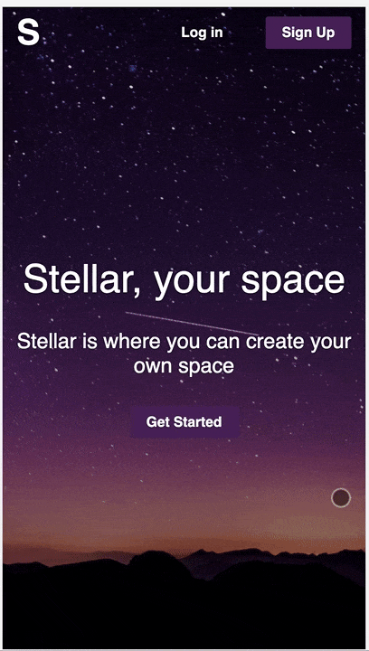
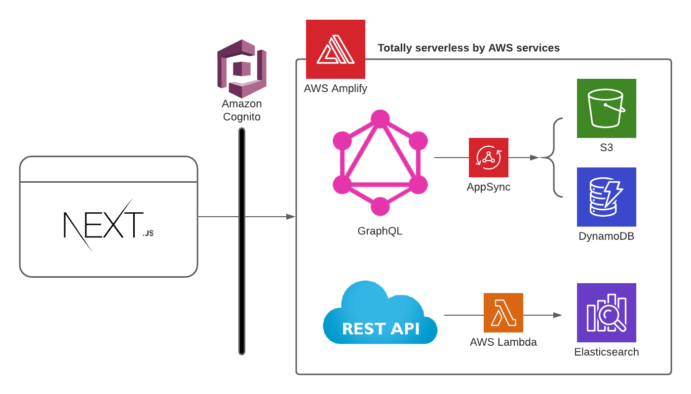
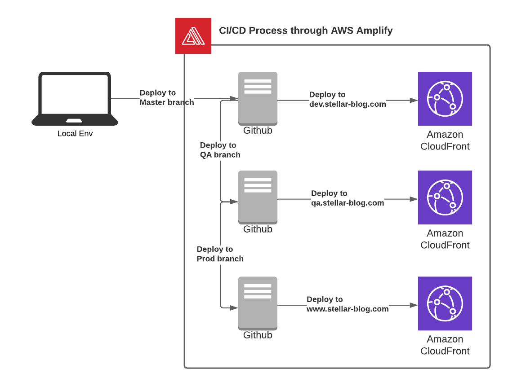

# stellar-blog.com
> Fullstack webapp deployed on https://www.stellar-blog.com

It's a blog style social media webapp built with Next.js & GraphQL on AWS.

## Preview

## Development tools
### Front-end
- HTML 5, CSS 3, Javascript (ES6)
- Next.js (React.js)
- Styled Components

### Back-end
- Node.js (v12)
- Express.js
- GraphQL

### Unit-test
- Jest
- Enzyme
- @testing-library

### AWS services
- AWS Amplify
- AWS Appsync
- AWS DynamoDB
- AWS S3
- AWS Congnito
- AWS Lambda
- AWS Route 53
- AWs CloudFront
- AWS ElasticSearch

## Core features
### Integrated with GraphQL and Rest API
> Generated fully working APIs from GraphQL schema

- [Click it to see GraphQL schema](https://github.com/Stellar-blog/stellar-blog-webapp/blob/master/amplify/backend/api/stellagraphqlapi/schema.graphql)

### Blog system
- [x] let user submit their post
- [x] let user add hashtags on their post
- [x] let user see a list of all posts others uploaded
- [x] let user see a list of posts the user uploaded
- [x] let user see a list of options for settings
- [x] let user delete their post
- [ ] let user edit their post (WIP)
- [ ] let user follow other bloggers (WIP)
- [ ] let user like other posts (WIP)
- [ ] let user comment on a post (WIP)

### Authentication flow built with AWS Cognito

- [x] let user sign up with their email
- [x] verify user by email
- [x] let user log in with their username
- [x] let user log out
- [ ] let user change their password (WIP)
- [ ] let user delete their account (WIP)
- [ ] redirect unauthenticated users (WIP)

### Photo upload flow
> Implemented a draggable & dropable UI for better user experience

- [x] let user upload up to 3 photos at once
- [x] let user drag and drop their photos
- [x] let user search a photo with their local OS
- [x] store user-uploaded photos on AWS S3
- [ ] convert formats to webp and resize to fit the window with AWS Lambda (WIP)

### Search flow by hashtag
> Implemented an auto-suggestion system with a Trie strucutre for faster performance and better user experience.

- [x] let user search posts by hashtag
- [x] let user see a list of auto-suggestions 

### CICD flow built with Amplify & Github
> Implemented multi-environments; Master/QA/Prod, and had each domain SSL certified by AWS Certificate Manager to enable HTTPS

- [x] deploy Master branch to https://dev.stellar-blog.com
- [x] deployed QA branch to https://qa.stellar-blog.com
- [x] deployed Prod branch to https://www.stellar-blog.com

### Performance optimization
- [x] image rendering with a loader 

### Mobile viewport support
- [x] support desktop viewport (window width greater than 600px)
- [x] support mobile  viewport (window width less than 600px)

### Browser compaitibility
- [x] support Chrome
- [x] support Firefox
- [x] support Safari
- [x] support Edge

### Unit-test result
- [ ] set up a testing environment with Jest (WIP)

### Web accessbility (with Keyboard)
- [x] let user sign up
- [x] let user log in
- [ ] let user browse through nav menus (WIP)
- [ ] let user upload a photo (WIP)
- [x] let user add hashtags 
- [x] let user submit a post
- [x] let user search posts by hashtags
- [ ] let user browse a list of auto-suggestions (WIP)

### Internationalization
- [ ] redirect based on user's location (WIP)
- [x] support English
- [ ] support Korean (WIP)

### To-do list
- [ ] refactor with Typescript
- [ ] format the code with ESLint, Airbnb Style Guide, and Prettier

## Meta Data
Jong-Ho (James) Kim
- [Github](https://github.com/april9288) - Github page
- [Linkedin](http://www.linkedin.com/in/james-kim-dev) - Linkedin page
- [Medium](https://medium.com/@april9288) - Medium blog
- april9288@gmail.com
